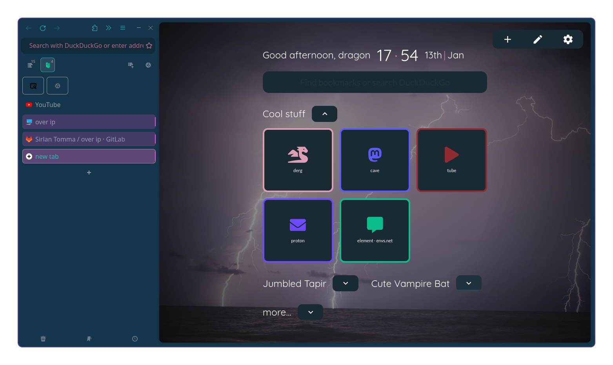

# arcticfox theme
a theme for Firefox (and Sidebery, because it fancy) to make it look and somewhat behave like Arc  

---

ℹ️ **addons to use**

- [sidebery](https://github.com/mbnuqw/sidebery) for sidebar tabs, workspaces, groups...
- [Firefox Multi-Account Containers](https://addons.mozilla.org/en-GB/firefox/addon/multi-account-containers) for multiple logins
- [Userchrome Toggle](https://addons.mozilla.org/en-GB/firefox/addon/userchrome-toggle) for toggling keeping the sidebar open (migh try creating an extensions for extra controls later, idk)
- (preference) [Firefox Color](https://addons.mozilla.org/en-GB/firefox/addon/firefox-color/)

# how to install

* clone or download this repo locally
* install the listed addons
* open sidebery settings, go to 'help' and 'import addon data', then select the json file in `sidebery/sidebery-data.json`
* (if not showing already) open the browser sidebar and select the 'sidebery' sidebar
* in the settings for the 'userchrome toggle' extension, for the 'style toggle 1' put `|| ` in prefix (should also have the ending space) and apply changes (you migh also change the name to 'sidebar' if you want, and disable the 'display notification')
* reorder the browser toolbar widgets, they should be in the order
    * `url-bar  sidebar-toggle-button  back  forward  reload  spacer  extensions-button  overflow-menu  hamburger-menu`
    * **the url bar must be the first item**

**if you don't have userChrome (and browser dev tool) enabled (if you do, skip to the next)**

* go to `about:config` in the url bar (and accept the message)
* in the search bar insert `toolkit.legacyUserProfileCustomizations.stylesheets`
* if besides it there is a 'false', double click it, it should turn into 'true'

* right click anywhere in the page and open 'inspect' from the menu, it should open the dev panel
* click the three dots at the top right corner of that panel and in settings
* right at the bottom/right in the 'advanced' enable 'anable browser chrome and add-on debugging toolboxes' and 'enable remote debugging'

* close and re-open firefox

_read next section_

(if you want to activate the browser dev tool to inspect the browser ui and live change the css, press 'ctrl + shift + alt + i', it behaves like the normal dev tool but for the browser)

**if/when you have userChrome (and browser dev tools) enabled**

* write `about:profiles` in the url bar (and accept the message?)
* on the profile that is listed as 'default profile: yes' click 'open directory' for the root directory, it should open your file manager in that folder
* create (if doesn't exist) a sub folder called 'chrome' (exact name, all minuscule)
* put the file `chrome/userChrome.css` in there (the file must be called 'userChrome.css')

(you might want to edit some settings in the css file, feel free to open it in your text editor)

* close and re-open firefox, it should have the theme applied

# using

- put your mouse on the left edge of the window to open the side bar containing the tabs, url bar, and browser toolbar
- to keep the side bar open, on the extensions list from the toolbar, click the userchrome togge one, it should now keep the sidebar open (might glitch a bit)
- for workflow stuff, see the sidebery documentation

---

⚠️ **btw**

this theme is:
- buggy in some places
- only tested in firefox 119 on linux
- best used with the [sidebery extension](https://github.com/mbnuqw/sidebery) but I guess can be used with Tree Style Tab, didn't test
- best used with themes from 'firefox colour' that have no backgrounds or gradients
- not guaranteed to be 100% working out of the box, you might need to tweak it some

(for some more info and warnings see the comments in `chrome/userChrome.css`)
